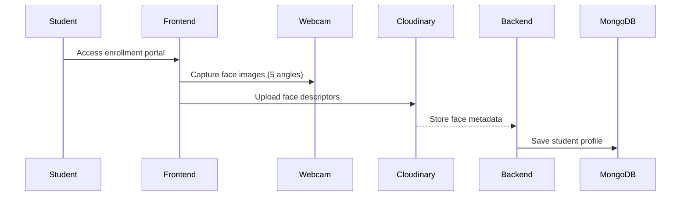
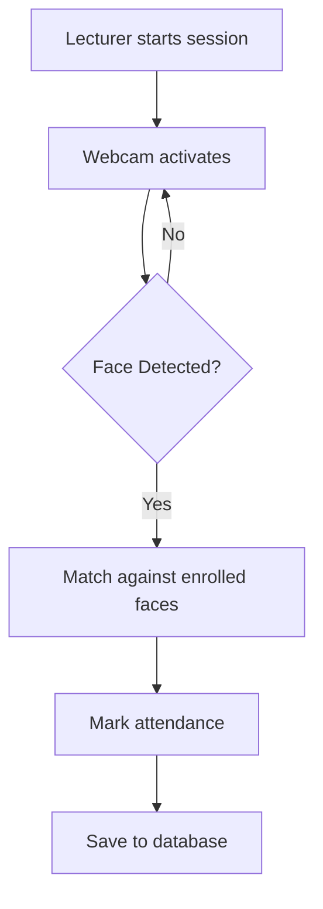

# Face Recognition Attendance System (EMARKER)

**API ON AZURE CLOUD:** [Visit API](https://emarker-webapp-c9bthufna7ghagh6.eastus-01.azurewebsites.net/emarker-api-doc)

**CLIENT ON AZURE CLOUD:** [Visit Site](https://emarker-webapp-c9bthufna7ghagh6.eastus-01.azurewebsites.net/) 


_Real-time face detection and attendance marking in action_

## 🌟 Introduction

EMARKER is a **full-stack facial recognition attendance system** built on the MERN stack (Node.js, Express, React, MongoDB). It automates classroom attendance by identifying students through webcam face detection, eliminating manual roll calls.

## ✨ Key Features

| Feature                    | Description                                  |
| -------------------------- | -------------------------------------------- |
| 👨🏫 **Role-Based Access** | Admin, Lecturers, and Student dashboards     |
| 📸 **Face Enrollment**     | Register student faces with webcam captures  |
| 🎥 **Real-Time Detection** | Live classroom attendance marking via webcam |
| 📊 **Automated Reports**   | Generate PDF attendance reports by course    |
| ☁ **Cloud Storage**        | Student faces stored securely in Cloudinary  |

  
_Admin portal for managing courses and users_

## 🛠 Tech Stack

### Frontend

- **React.js** (Vite)
- **face-api.js** - Real-time face recognition
- **Tailwind CSS** - Modern styling
- **jsPDF** - PDF report generation

### Backend

- **Node.js & Express** - API server
- **MongoDB** - Database
- **JWT** - Authentication
- **Cloudinary** - Image storage

### AI Components

- **68-Point Face Landmark Detection**
- **Face Descriptor Extraction**
- **Euclidean Distance Matching**

## 🚀 Getting Started

### Prerequisites

- Node.js ≥16.x
- MongoDB Atlas account or local instance
- Cloudinary account (for image storage)

### Installation

1. **Clone the repository**

   ```bash
   git clone https://github.com/Melvins-Simon/emarker-face-recognition.git
   cd emarker-face-recognition
   ```

2. **Set up environment variables**  
   Create `.env` files in both `server/` and `client/` with:

# Server: .env

```bash

 MONGO_URI=your_mongo_uri
 PORT=5000
 NODE_ENV=development
 SECRETE_KEY=your_secret_key
 RESET_PASSWORD_LINK=http://localhost:5173/auth/reset-password/
 NODEMAILER_PASSWD=your_nodemailer_app_password
 NODEMAILER_USER=nodemailer_user_email
 CLIENT_URL= http://localhost:5173
 CLOUDINARY_CLOUD_NAME=your_cloudinary_name
 CLOUDINARY_API_KEY=api_key
 CLOUDINARY_API_SECRET=api_secret_key
```

3. **Install dependencies**

   ```bash
   # Server
   cd server && npm install

   # Client
   cd ../client && npm install
   ```

4. **Run the application**

   ```bash
   # Start backend
   cd server && npm run server

   # Start frontend (in new terminal)
   cd client && npm run dev
   ```

## 📂 Project Structure

```
emarker/
├── server/
│   ├── controllers/       # Route controllers
│   ├── models/            # MongoDB schemas
│   ├── routes/            # API endpoints
│   ├── email/             # Email templates and functions
│   └── utils/             # Face recognition utils and nodemailer libs
│
└── client/
    ├── src/
    │   ├── components/    # Reusable UI components
    │   ├── pages/         # Route pages
    │   ├── store/         # Zustand state management
    │   ├── hooks/         # Custom hooks
```

## 🔧 Key Functionality

### 1. Face Enrollment Workflow



### 2. Attendance Marking Process



## 📜 API Documentation

| Endpoint                           | Method            | Description                      |
| ---------------------------------- | ----------------- | -------------------------------- |
| `/api/auth/*`                      | [POST,GET,DELETE] | Authentications                  |
| `/api/mark-attendance`             | POST              | Initiate attendance session      |
| `/api/dash/get-courses`            | GET               | Get attendance records           |
| `/api/faces`                       | GET               | Training dataset from cloudinary |
| `/api/student/upload-face-dataset` | POST              | Upload dataset to cloudinary     |

[](https://documenter.getpostman.com/view/39583603/2sB2j68AA3)

## 🧪 Testing the System

1. **Admin Credentials**

   ```
   Register-->Login as Admin
   ```

2. **Sample Test Flow**
   - Admin creates course "CS-101"
   - Lecturer starts session and student's attenance marked with their faces automatically.
   - Report download.

  
_Sample PDF attendance report_

## 🚨 Troubleshooting

**Issue**: Face detection not working  
✅ **Solution**:

- Ensure proper lighting conditions
- Check camera permissions
- Verify face-api.js models are loaded

**Issue**: Cloudinary upload fails  
✅ **Solution**:

- Validate CLOUDINARY_URL in .env
- Check network connectivity

## 📜 License

MIT License - See [LICENSE](LICENSE) for details

## 🙏 Acknowledgements

- **face-api.js** team for the powerful recognition library
- **Cloudinary** for media storage solutions
- **Vite** team for the blazing-fast build tool

---

Developed with ❤️ by [Melvins Simon](https://github.com/Melvins-Simon)

```

```
